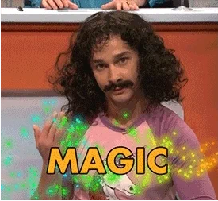

# Bootstrap Cluster and GitOps

## Bootstrap Cluster

* RHOAI-Cluster folder contains the yaml resources to bootstrap the cluster.

```md
openshift-install create cluster --dir rhoaibu-cluster-dev --log-level=debug
```

## Extra MachineSets

### ODF Machineset

* Increase at least 3 machinesets for the cluster to have a minimum of 2 worker nodes per machineset (9x m6i.4xlarge).

* Create OCS Machineset for OCS Cluster

```md
bash bootstrap/machinesets/ocs-machineset.sh
```

### GPU Machineset

* Create GPU Machineset using g5, p4 or p5 instance types

```md
bash bootstrap/machinesets/gpu-machineset.sh
```

if you want p4 or p5, you can change the use the gpu-machineset-big.sh.

## Bootstrap OpenShift-GitOps

* Bootstrap the OpenShift GitOps Operator, Instance and RBAC using the following command.

```md
until oc apply -k bootstrap/; do sleep 2; done
```

## Google OAuth Configuration

For Google OAuth Configuration, we need to create a OAuth Credential and add the Redirect URI in Google Cloud Console.

1. Go to [Google Cloud Console](https://console.cloud.google.com/apis/credentials)
2. Change the project to "rhods-internal"
3. Create Credentials -> OAuth Client ID
4. Application Type: Web Application
5. Name: rhoai-internal
6. Authorized Redirect URIs (replace your own): `https://oauth-openshift.apps.<CLUSTER_DOMAIN>/oauth2callback/RedHat-Google-Auth`
7. Another Authorized Redirect URIs (replace your own): `https://oauth-openshift.apps.<CLUSTER_DOMAIN>/oauth2callback/RedHatAuth`
8. Copy and Update the ClientID and ClientSecret in the components/configs/overlays/google-client.yaml and patch-idp.yaml

## Prepare for External Secret
External Secret requires AWS Secret Manager access information in order to sync the secrets from the vault. Before applying GitOps configration, we need to create the necessary AWS secret. This config lives in a private repository 🐓🥚 First, we need Argo CD to access this repo and then, we need to apply it before moving forward.

```bash
git clone https://github.com/rh-aiservices-bu/rh-aiservices-bu-bootstrap.git 
oc apply -f bootstrap/argocd/secret.yaml
oc apply -f bootstrap/argocd/<NAME_OF_CLUSTER>
```

## Apply GitOps Configuration

```md
kubectl apply -k clusters/overlays/<NAME_OF_CLUSTER>
```



## Create Cluster Certificates using GitOps and Cert-Manager + Let's Encrypt

* Create Cluster Certificates using GitOps and Cert-Manager and Let's Encrypt in AWS Route53 by following [this documentation](https://github.com/rh-aiservices-bu/rh-aiservices-bu-bootstrap/blob/main/cluster-certs/README.md).

NOTE: The certificates will expire in 3 months from the creation date. The certs will be reissued automatically by Cert-Manager but not patched.

## ClusterAutoscaling for GPUs - RHOAIBU Regular Users (Tesla T4s) 

```bash
kubectl apply -k components/configs/autoscaling/overlays/gpus-accelerator-label
```

NOTE: The machinesets/nodes needs to be labeled with "Tesla-T4-SHARED"

## Remove Kubeadmin User

>IMPORTANT: Only remove the Kubeadmin user if you're correctly logged in with the RH Google Auth user and you have cluster-admin.

* [Remove the Kubeadmin](https://docs.openshift.com/container-platform/4.14/authentication/remove-kubeadmin.html) following the steps below:

```md
oc delete secrets kubeadmin -n kube-system
```

## Components Structure

* [GitOps ApplicationSets](../components/argocd/apps)
* [GitOps Projects](../components/argocd/projects)
* [GitOps Configs - Applied using Config AppSet](../components/configs)
* [GitOps Operator Instances - Applied using Oper Instances AppSet](../components/instances)
* [GitOps Operator - Applied using Operator AppSet](../components/operators)
* [GitOps Operator Extras - Applied using Operator Extras AppSet](../components/operators-extra)

## Disaster Recovery

**NOTE:** The configuration currently lives in another [repository](https://github.com/rh-aiservices-bu/rh-aiservices-bu-bootstrap.git).
